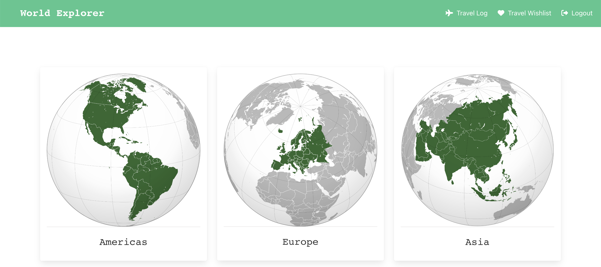
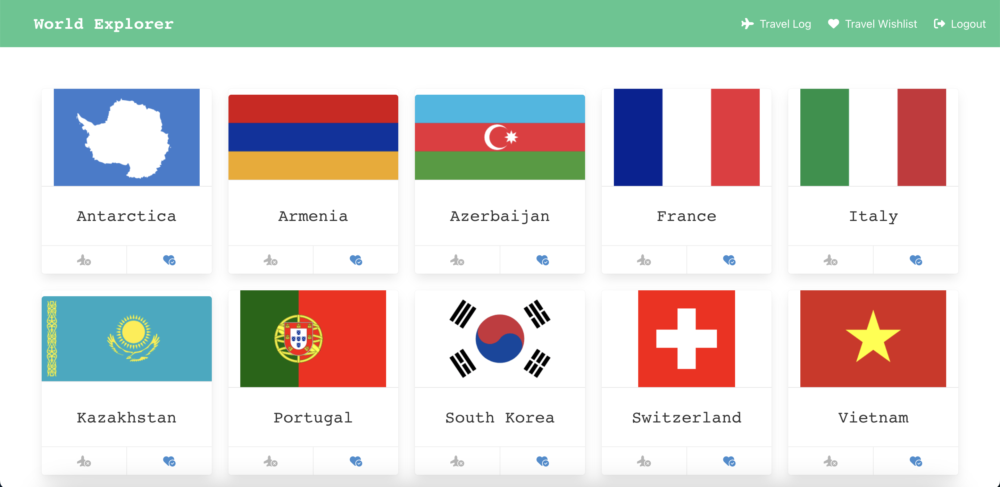

# World Explorer
This app will help you explore countries worldwide, allowing you to leave comments, create a travel log, and build your personal wishlist.

# Screenshots

# Technologies Used
- **HTML, CSS, Bulma framework**
- **Python, Django, Django Auth**
- **REST API**
- **PostgreSQL**
- **Git**
- **Visual Studio Code**

# Getting Started
- **Link to the app**: https://world-explorer-4.herokuapp.com/
- **Trello board**: https://trello.com/b/oJGzUKoH/project-4

# Next Steps
- **Add a search function to the navigation bar**
- **Implement filtering functions for country languages**